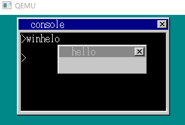

# Chapter22 C言語でアプリケーションを作ろう

## 0. 前回のまとめ
- OSを守りたい
    - OS用，アプリ用のCSとDSを分離
    - 例外処理の実装
    - CPUの機能を使ってOS用のDSへの代入阻止

## 1. OSを守ろう(5) (harib19a)
- いろいろな手を尽くして悪さをしたい
- 例外発生することなく悪さができたら成功

### 悪さその1.タイマの割り込み周期変更
``` {.line-number}
; crack3.nas
[INSTRSET "i486p"]
[BITS 32]
		MOV		AL,0x34
		OUT		0x43,AL
		MOV		AL,0xff
		OUT		0x40,AL
		MOV		AL,0xff
		OUT		0x40,AL

; 	↑これは以下のプログラムに相当
;	io_out8(PIT_CTRL, 0x34);
;	io_out8(PIT_CNT0, 0xff); 割り込み周期の下位8bit
;	io_out8(PIT_CNT0, 0xff); 割り込み周期の上位8bit をそれぞれ設定

;   割り込み周期変更に関してはp233参照

		MOV		EDX,4
		INT		0x40
```
- 結果は，，，失敗（例外発生）
    - アプリモードで動いているときはIN命令やOUT命令が一般保護例外になる

### 悪さその2.CLI→HLT
```
; crack4.nas
[INSTRSET "i486p"]
[BITS 32]
		CLI
fin:
		HLT
		JMP		fin
```
- 結果は，，，失敗（例外発生）
    - アプリモードではCLT，STI，HLTすべてが例外になる
    - 割り込み関係はOSが管理するのでアプリは触れないようになってる

### 悪さその3.OS中のCLIをする関数をfar-CALL
- bootpack.mapの中からcliする関数のアドレスを調べる
```
; bootpack.map
0x00000A52 : (.text)
0x00000A52 : _io_hlt
0x00000A54 : _io_cli ←コレ
0x00000A56 : _io_sti
```
```
; crack5.nas
[INSTRSET "i486p"]
[BITS 32]
		CALL	2*8:0xa54 ;直接呼び出し
		MOV		EDX,4
		INT		0x40
```
- 結果は，，，失敗（例外発生）
    - アプリはINT 0x40経由でしかOSを呼び出すことはできない
        - 割り込みしかダメってこと？

### 悪さその4.APIを改造
- レジスタに特定の値が入っていた場合，OSを壊すようにAPIを改造
```c
/* console.c */
int *hrb_api(int edi, int esi, int ebp, int esp, int ebx, int edx, int ecx, int eax)
{
	int cs_base = *((int *) 0xfe8);
	struct TASK *task = task_now();
	struct CONSOLE *cons = (struct CONSOLE *) *((int *) 0x0fec);
	if (edx == 1) {
		cons_putchar(cons, eax & 0xff, 1);
	} else if (edx == 2) {
		cons_putstr0(cons, (char *) ebx + cs_base);
	} else if (edx == 3) {
		cons_putstr1(cons, (char *) ebx + cs_base, ecx);
	} else if (edx == 4) {
		return &(task->tss.esp0);
	} else if (edx == 123456789) {
        /* edxに特定の値が入るとOS管理のメモリに値が書き込まれる */
		*((char *) 0x00102600) = 0;　
	}
	return 0;
}
```
```
; crack6.nas
[INSTRSET "i486p"]
[BITS 32]
        ; EDXに値をセットしてAPIの呼び出し
		MOV		EDX,123456789
		INT		0x40
		MOV		EDX,4　　　　　　　　　
		INT		0x40
```
- 成功！！（例外発生せず）
    - OS側に欠陥があるのではどうしようもない
    - 信用できないOSは使ってはいけない

## 2. バグ発見を手伝おう（harib19b）
### バグを含んだアプリケーションを実行してみる
```c
/* bug1.c */
void HariMain(void)
{
	char a[100];
	a[10] = 'A';		/* 配列内への代入（セーフ） */
	api_putchar(a[10]);
	a[102] = 'B';		/* 配列の外への代入（アウト） */
	api_putchar(a[102]);
	a[123] = 'C';		/* 配列の外への代入（アウト） */
	api_putchar(a[123]);
	api_end();
}
```
- QEMU上だとなぜか実行できる
	- なんで？

		

- 実機だと設定されていない例外が発生してPCがリセットされるらしい
	- スタック例外が発生する（まだOSでは設定されていない例外）
	- 配列のデータが置かれたスタック上で領域外アクセスが起こっているのでスタック例外が出されている

### スタック例外（割り込み番号0x0c）を受け付けるようにする
- `inthandler0c`の設定　（`inthandler0d`の時とメッセージを変えただけ）
	- スタック例外のメッセージを出して異常終了させる
```c
/* console.c */int *inthandler0c(int *esp)
{
	struct CONSOLE *cons = (struct CONSOLE *) *((int *) 0x0fec);
	struct TASK *task = task_now();
	char s[30];
	cons_putstr0(cons, "\nINT 0C :\n Stack Exception.\n");
	sprintf(s, "EIP = %08X\n", esp[11]);
	cons_putstr0(cons, s);
	return &(task->tss.esp0);	/* 異常終了させる */
}
```
- QEMU上だとやっぱり例外が出ない
- 実機だと"AB"と表示されてから例外が出るらしい
	- a[102]は配列の領域は飛び出してるけどアプリのデータセグメント内なので文句をいわれない

### 例外を起こした命令の番地を取得してみる
- デバッグのために，例外発生時に例外を起こした命令の番地を吐き出すようにしてみる
	- EIP（命令の番地）はESPから数えて11番目に積まれてるらしいので，そこから読みだす
	- 例外発生 → 現在の命令の番地をpushして例外処理をcallしてるから命令の番地が残っている？
```c
/* console.c */
int *inthandler0c(int *esp)
{
	struct CONSOLE *cons = (struct CONSOLE *) *((int *) 0x0fec);
	struct TASK *task = task_now();
	char s[30];
	cons_putstr0(cons, "\nINT 0C :\n Stack Exception.\n");
	sprintf(s, "EIP = %08X\n", esp[11]); /* ESPから11番目の値を読みだす */
	cons_putstr0(cons, s);
	return &(task->tss.esp0);	/* 異常終了させる */
}
```
- 実機で試せないからわからないけど，例外を発生させた`a[123] = 'C'`の命令番地が出てくるらしい
- ちなみに，EIP以外にも他のレジスタには以下のような値が入っているので場合によって出力させるのもよい


## 3. アプリの強制終了（harib19c）
- アプリが無限ループしているときに，キーボード操作で強制終了させたい
	- `bootpack.c`に強制終了タスクを書く
		- `console.c`のconsole_taskではアプリの実行中にFIFOバッファを見てくれない
	- 強制終了ボタンは`Shift + F1`
```c
/* bootpack.c */
if (i == 256 + 0x3b && key_shift != 0 && task_cons->tss.ss0 != 0) {	/* Shift+F1が押されている　かつアプリが動いている */
	cons = (struct CONSOLE *) *((int *) 0x0fec);
	cons_putstr0(cons, "\nBreak(key) :\n");　/* 終了メッセージをコンソールに出力 */
	io_cli();	/* 強制終了処理中にタスクが変わると困るので割り込み禁止 */
	task_cons->tss.eax = (int) &(task_cons->tss.esp0);
	task_cons->tss.eip = (int) asm_end_app;
	io_sti();
}
```
- アプリが動いてないときに強制終了が起こると誤動作が起こるのでtask_cons->tss.ss0をみてアプリがちゃんと動いているか確認
- アプリが動いていない時にはtask_cons->tss.ss0が確実に0になるように`naskfunc.nas`と`mtask.c`を改造


- 無限に"a"を出力するアプリも無事強制終了できた

	


## 4. C言語で文字列表示(1)（harib19d）
### C言語から文字列表示APIを呼び出したい
- とりあえずC言語でアプリを作成
```
; a_nask.nas
_api_putstr0:	; void api_putstr0(char *s);
		PUSH	EBX
		MOV		EDX,2 ; 機能番号2（文字列表示0） 機能番号はp.418参照
		MOV		EBX,[ESP+8]		; EBXに文字列の番地を代入
		INT		0x40
		POP		EBX
		RET
```
```c
/* hello4.c */
void HariMain(void)
{
	api_putstr0("hello, world\n");
	api_end();
}
```
- 実行しても何も出てこず
	- なぜ？

### 一旦置いといてconsole.cの改造
- `console.c`で，.hrbの先頭6バイトを書き換えてた（Chapter21:harib18b）けど，いらなくなったので消す
	- 6バイト = （関数呼び出し　→　RETFでコンソールへ戻ってくる処理）
	- Chapter21でRETFによってアプリを呼び出すようにしたので，RETFでアプリを終了させることができない
		- OSがアプリを起動するときにアプリ用のセグメントへfar-CALLする必要がある
		- x86の仕組みではそれができないのでRETFを使ってアプリを呼び出している
- 0x1bにJMPできるようにconsole.cを改造
```c
/* console.c */
if (finfo != 0) {
	/* ファイルが見つかった場合 */
	（中略）
	if (finfo->size >= 8 && strncmp(p + 4, "Hari", 4) == 0) {
		/* 0x1b（HariMainの番地）*/
		start_app(0x1b, 1003 * 8, 64 * 1024, 1004 * 8, &(task->tss.esp0));
	} else {
		start_app(0, 1003 * 8, 64 * 1024, 1004 * 8, &(task->tss.esp0));
	}
	memman_free_4k(memman, (int) p, finfo->size);
	memman_free_4k(memman, (int) q, 64 * 1024);
	cons_newline(cons);
	return 1;
}
```

## 5. C言語で文字列表示(2)（harib19d）

### 前節でうまく文字列が表示されなかった理由
- EBXに"hello, world\n"が格納された番地が入ってるはずだけど，入ってなかった
	```
	; a_nask.nas
	_api_putstr0:	; void api_putstr0(char *s);
			PUSH	EBX
			MOV		EDX,2 ; 機能番号2（文字列表示0） 機能番号はp.418参照
			MOV		EBX,[ESP+8]		; EBXに文字列の番地を代入  ← ココ！
			INT		0x40
			POP		EBX
			RET
	```
- なんで？ → EBXはアプリ用のデータセグメントを見ているけど，そこにデータ（今回は"hello, world\n"）を置いていなかったから
- hrbファイルの先頭36バイトにデータ部分の転送番地などが記述されているのでデータセグメントの番地とかサイズの設定を確認する
	- bim2hrbで.hrbファイルを作ると自動で付与される情報

 	

### データをデータセグメントに置くように`console.c`を修正
- データセグメントの大きさを.hrbファイルに書かれているサイズ分だけ確保
- .hrbファイル内のデータをデータセグメントにコピー
- ファイル内に"Hari"が書かれていない場合（bim2hrbで作った.hrbファイルでない場合）はエラーを出す
	```c
	/* console.c */
	if (finfo != 0){
		/* ファイルが見つかった場合 */
		p = (char *) memman_alloc_4k(memman, finfo->size);
		file_loadfile(finfo->clustno, finfo->size, p, fat, (char *) (ADR_DISKIMG + 0x003e00));
		if (finfo->size >= 36 && strncmp(p + 4, "Hari", 4) == 0 && *p == 0x00) {
			segsiz = *((int *) (p + 0x0000)); /* 0x0000 == アプリ用のデータセグメントの大きさ */
			esp    = *((int *) (p + 0x000c)); /* 0x000c == ESPの初期値&データ部分の転送番地 */
			datsiz = *((int *) (p + 0x0010)); /* 0x0010 == データ部分の大きさ */
			dathrb = *((int *) (p + 0x0014)); /* 0x0014 == データ部分の開始番地 */
			q = (char *) memman_alloc_4k(memman, segsiz); /* データを置くためのメモリを確保 */
			*((int *) 0xfe8) = (int) q;
			set_segmdesc(gdt + 1003, finfo->size - 1, (int) p, AR_CODE32_ER + 0x60);
			set_segmdesc(gdt + 1004, segsiz - 1,      (int) q, AR_DATA32_RW + 0x60);
			for (i = 0; i < datsiz; i++) {
				/* データ（今回は"hello, world\n"）を転送先にコピー*/
				q[esp + i] = p[dathrb + i];
			}
			start_app(0x1b, 1003 * 8, esp, 1004 * 8, &(task->tss.esp0));
			memman_free_4k(memman, (int) q, segsiz);
		} else {
			/* ファイル内に"Hari"が書かれていない場合（bim2hrbで作った.hrbファイルでない場合）はエラー */
			cons_putstr0(cons, ".hrb file format error.\n");
		}
		memman_free_4k(memman, (int) p, finfo->size);
		cons_newline(cons);
		return 1;
	}
	```
- 無事実行できた（bin2hrbで作ってないhello.hrbは動かなくなってる）

 	

### アセンブラだけでアプリを作ってみる
```
; hello5.nas
[FORMAT "WCOFF"]
[INSTRSET "i486p"]
[BITS 32]
[FILE "hello5.nas"]

		GLOBAL	_HariMain

[SECTION .text]

_HariMain:
		MOV		EDX,2
		MOV		EBX,msg
		INT		0x40
		MOV		EDX,4
		INT		0x40

[SECTION .data] ; 以下の部分はデータセグメントに置く部分

msg:
		DB	"hello, world", 0x0a, 0
```
- 問題なく動いた（ちゃんとbim2hrbで.hrbファイルを作るようにMakefileに書く）

	

## 6. ウィンドウを出そう（harib19f）

### ウィンドウを出すAPIの作成
- APIの設定
	- OSに渡す値
		- EDX = 5
		- EBX = ウィンドウのバッファ
		- ESI = ウィンドウのx方向の大きさ
		- EDI = ウィンドウのy方向の大きさ
		- EAX = 透明色
		- ECX = ウィンドウの名前
	- アプリに返す値
		- EAX = ウィンドウを操作するための番号（リフレッシュとかに必要）

- アプリ側にレジスタから値を渡す方法
	- asm_hrb_apiがPOPするEAXの値を書き換えて渡す
		- スタックにPUSHされてる値を見つけて書き換える
		```
		; naskfunc.nas
		_asm_hrb_api:
				STI
				PUSH	DS
				PUSH	ES
				PUSHAD		; 保存のためのPUSH　ここでPUSHされたものが後でPOPされる
				PUSHAD		; hrb_apiにわたすためのPUSH　ここの変数の番地を調べれば上でPUSHされたEAXの番地が推測できる
				MOV		AX,SS
		```

		```c
		/* console.c */
		int *hrb_api(int edi, int esi, int ebp, int esp, int ebx, int edx, int ecx, int eax) /* 二回目のPUSHADで渡された値 */
		{
			int ds_base = *((int *) 0xfe8);
			struct TASK *task = task_now();
			struct CONSOLE *cons = (struct CONSOLE *) *((int *) 0x0fec);
			struct SHTCTL *shtctl = (struct SHTCTL *) *((int *) 0x0fe4); /* bootpack.cから0x0fe4経由でshtctlの値が渡される */
			struct SHEET *sht;
			int *reg = &eax + 1;	/* EAXの次の番地 */
				/* 保存のためのPUSHADを強引に書き換える */
				/* reg[0] : EDI,   reg[1] : ESI,   reg[2] : EBP,   reg[3] : ESP */
				/* reg[4] : EBX,   reg[5] : EDX,   reg[6] : ECX,   reg[7] : EAX */

			if (edx == 1) {
				cons_putchar(cons, eax & 0xff, 1);
			} else if (edx == 2) {
				cons_putstr0(cons, (char *) ebx + ds_base);
			} else if (edx == 3) {
				cons_putstr1(cons, (char *) ebx + ds_base, ecx);
			} else if (edx == 4) {
				return &(task->tss.esp0);
			} else if (edx == 5) { /* 機能番号5番でウィンドウ表示APIの呼び出し */
				sht = sheet_alloc(shtctl);
				sheet_setbuf(sht, (char *) ebx + ds_base, esi, edi, eax);
				make_window8((char *) ebx + ds_base, esi, edi, (char *) ecx + ds_base, 0);
				sheet_slide(sht, 100, 50);
				sheet_updown(sht, 3);	/* 3という高さはtask_aの上 */
				reg[7] = (int) sht; ; EAXにアプリに渡したい値を格納
			}
			return 0;
		}
		```

- テストアプリを作って実行

	

## 7. ウィンドウに文字や四角を書こう（harib19g）
- ウィンドウへ文字を表示させるAPI
	- EDX = 6
	- EBX = ウィンドウの番号
	- ESI = 表示位置のx座標
	- EDI = 表示位置のy座標
	- EAX = 色番号
	- ECX = 文字列の長さ
	- EBP = 文字列
- ウィンドウに四角を描くAPI
	- EDX = 7
	- EBX = ウィンドウの番号
	- EAX = x0
	- ECX = y0
	- ESI = x1
	- EDI = y1
	- EBP = 色番号

```c
/* console.c */
int *hrb_api(int edi, int esi, int ebp, int esp, int ebx, int edx, int ecx, int eax)
{
		/* 中略 */
	} else if (edx == 6) { /* 機能番号6番でウィンドウへ文字を表示させるAPIの呼び出し */
		sht = (struct SHEET *) ebx;
		putfonts8_asc(sht->buf, sht->bxsize, esi, edi, eax, (char *) ebp + ds_base);
		sheet_refresh(sht, esi, edi, esi + ecx * 8, edi + 16);
	} else if (edx == 7) { /* 機能番号7番でウィンドウに四角を描くAPIの呼び出し */
		sht = (struct SHEET *) ebx;
		boxfill8(sht->buf, sht->bxsize, ebp, eax, ecx, esi, edi);
		sheet_refresh(sht, eax, ecx, esi + 1, edi + 1);
	}
	return 0;
}
```

```
; a_nask.nas
_api_putstrwin:	; void api_putstrwin(int win, int x, int y, int col, int len, char *str);
		PUSH	EDI
		PUSH	ESI
		PUSH	EBP
		PUSH	EBX
		MOV		EDX,6
		MOV		EBX,[ESP+20]	; win
		MOV		ESI,[ESP+24]	; x
		MOV		EDI,[ESP+28]	; y
		MOV		EAX,[ESP+32]	; col
		MOV		ECX,[ESP+36]	; len
		MOV		EBP,[ESP+40]	; str
		INT		0x40
		POP		EBX
		POP		EBP
		POP		ESI
		POP		EDI
		RET

_api_boxfilwin:	; void api_boxfilwin(int win, int x0, int y0, int x1, int y1, int col);
		PUSH	EDI
		PUSH	ESI
		PUSH	EBP
		PUSH	EBX
		MOV		EDX,7
		MOV		EBX,[ESP+20]	; win
		MOV		EAX,[ESP+24]	; x0
		MOV		ECX,[ESP+28]	; y0
		MOV		ESI,[ESP+32]	; x1
		MOV		EDI,[ESP+36]	; y1
		MOV		EBP,[ESP+40]	; col
		INT		0x40
		POP		EBX
		POP		EBP
		POP		ESI
		POP		EDI
		RET
```
```c
/* winhelo2.c */
char buf[150 * 50];

void HariMain(void)
{
	int win;
	win = api_openwin(buf, 150, 50, -1, "hello");
	api_boxfilwin(win,  8, 36, 141, 43, 3 /* 黄 */);
	api_putstrwin(win, 28, 28, 0 /* 黒 */, 12, "hello, world");
	api_end();
}

```
- 新たに作った"hello"ウィンドウ内に文字列と黄色い四角を表示できた

	