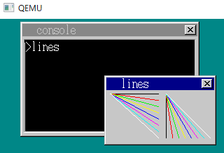
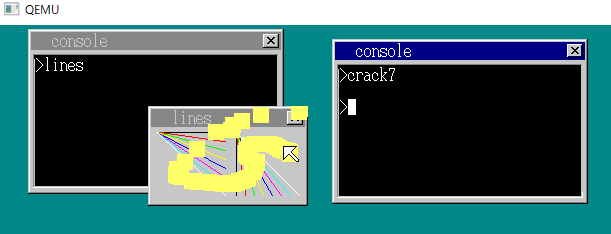

# Chapter27 LDTとライブラリ

## 0. 前回のまとめ
- ウィンドウ移動の高速化
    - sheet_refreshmapの挙動の最適化
		- 無駄な処理を省く（下敷きの透明部分あるなしを判断する部分を追加，等）
		- おっきなレジスタを使って命令を一気に書き込む
	- FIFOが空になってからウィンドウの描画行う（処理が早くなるわけではない）
- コンソールに関していろいろ
	- 最初のコンソールを一つにして，あとからたくさん呼び出せるように（shift+F2）
	- コンソールの終了処理（exitコマンド，×ボタンクリック）
	- start, ncstコマンド


## 1. まずはバグを直そう (harib24a)
- Chapter26の最後（harib23j）であったバグの修正
- バグ
	- ncstコマンドで起動したアプリがShift+F1や×ボタンのクリックに反応してくれない（終了処理ができない
- 原因
	- タスクがスリープしてるので終了処理が始まらない
- なんで今までのコンソールは終了処理ができてたの？
	- コンソールのカーソル点滅のために0.5秒毎の割り込み処理があったから
	- 実は終了処理までに最大で0.5秒の遅延があった
- 修正
	- `bootpack.c`のshit+F1とxボタンクリックの処理ににタスクを起こす命令`task_run(task, -1, 0)`を追加
	- ncst出起動したウィンドウでもxボタンクリックで消せるようになった
		- 割り込みを待つ時間がなくなるため，閉じる時間も早くなっているらしい，，，わからない


## 2.アプリ実行中でもコンソールを閉じたい(harib24b)
- 今の状態だとコンソールから（ncstを使わないで）アプリを起動すると起動したアプリが終了するまでコンソールを閉じることができない
- `bootpack.c`を改造
- xボタンが押されると，一旦コンソールを非表示にする
	- スムーズに閉じたように見せかけたいため
	- → 終了処理に時間がかかることもあるので
```c
/* bootpack.c */
; bootpack.c
if (sht->bxsize - 21 <= x && x < sht->bxsize - 5 && 5 <= y && y < 19) {
	/* 「×」ボタンクリック */
	if ((sht->flags & 0x10) != 0) {		/* アプリが作ったウィンドウか？ */
		(中略)
	} else {	/* コンソール */
		task = sht->task;
		sheet_updown(sht, -1); /* とりあえず非表示にしておく */
		keywin_off(key_win);
		key_win = shtctl->sheets[shtctl->top - 1];
		keywin_on(key_win);
		io_cli();
		fifo32_put(&task->fifo, 4);
		io_sti();
	}
}
```
- `console.c`の改造
	- sheetの代わりにcons.shtを使う
		- コンソールウィンドウが閉じられたらcons.shtを0に変更する（sheetは変わらない）
	- 入力待機中にコンソールタスクに4（xボタンが押された）が来たらコンソールを閉じる
```c
/* console.c */
if (i <= 1) { /* カーソル用タイマ */
↓
if (i <= 1 && cons.sht != 0) { /* カーソル用タイマ */
```
```c
/* console.c */
int *hrb_api(int edi, int esi, int ebp, int esp, int ebx, int edx, int ecx, int eax)
{
	(中略)
	} else if (edx == 15) {
		for (;;) {
			(中略)
			if (i == 4) {	/* 入力待機中にコンソールタスクに4（xボタンが押された）が来たらコンソールを閉じる */
				timer_cancel(cons->timer);
				io_cli();
				fifo32_put(sys_fifo, cons->sht - shtctl->sheets0 + 2024);	/* 2024～2279 */
				cons->sht = 0;
				io_sti();
			}
			(中略)
		}
```
- xボタンでコンソールが終了（起動したアプリのウィンドウはそのまま）

　

## 3.アプリケーションを守ろう(1)(harib24c)
- 動作中のアプリを壊してみる（`crack7.nas`）
```
; crack7.nas
[FORMAT "WCOFF"]
[INSTRSET "i486p"]
[BITS 32]
[FILE "crack7.nas"]

		GLOBAL	_HariMain

[SECTION .text]

_HariMain:
		MOV		AX,1005*8
		MOV		DS,AX
		CMP		DWORD [DS:0x0004],'Hari' ; 第一コンソールのコードセグメントと思われる場所に"Hari"という文字列が含まれるか調べる
		JNE		fin					; アプリではないようなので何もしない

		MOV		ECX,[DS:0x0000]		; このアプリのデータセグメントの大きさを読み取る
		MOV		AX,2005*8
		MOV		DS,AX

crackloop:							; 123で埋め尽くす
		ADD		ECX,-1
		MOV		BYTE [DS:ECX],123
		CMP		ECX,0
		JNE		crackloop

fin:								; 終了
		MOV		EDX,4
		INT		0x40

```
- アプリ起動 → crack7起動すると、こんな感じで先に起動してたアプリがおかしくなる




- 何が起こってるの？
	- アプリケーションのデータセグメントを書き換えられてる
		- 第一コンソールが起動したアプリ（図の例だとlines）のコードセグメント（1005）に「Hari」が含まれていたら，アプリが動いている可能性が高いので，意味のないデータでセグメントを上書きする → 壊れる
		- 今の所，保護をしてるのはOSのデータセグメントだけなので，アプリのデータを書き換えられても例外にならない

- 他のタスクのセグメントのデータは書き換えれないような仕組みが必要


## 4.アプリケーションを守ろう(2)(harib24d)
- アプリのデータをどうやったら保護できるか？
	- 例: 実行中のアプリのデータのみアプリ用のデータセグメントに置いて，それ以外のアプリのデータセグメントは一時的にOS用になるようにするとか
- 今回はCPUにあるLDTという仕組みを使う
	- LDT(local (segment) descriptor table)
	- 個々のタスク内でしか有効でないセグメント設定
	- アプリ用のセグメントをLDTの中で設定すると他のタスクからLDTを使えなくなる

- `bootpack.h`にセグメント属性番号を追加
```h
/* bootpack.h*/
#define AR_LDT			0x008
struct TASK {
	int sel, flags; /* selはGDTの番号のこと */
	int level, priority;
	struct FIFO32 fifo;
	struct TSS32 tss;
	struct SEGMENT_DESCRIPTOR ldt[2];
	struct CONSOLE *cons;
	int ds_base, cons_stack;
};
```
- TSSを作る際にLDTをGDTの中に設定し，そのLDT番号をtss.ldtrに書き込んでおく(`mtask.c`)
- アプリ用のセグメントをLDTの中に作るように`console.c`を改造
	- start_appでセグメント番号の指定の際に4を足すとLDTの番号として認識される
	- LDTはタスクに固有のモノなので，タスク同士でセグメント番号が被っていても自分のタスクのLDTにしかアクセスできない
```c
/* console.c */
int cmd_app(struct CONSOLE *cons, int *fat, char *cmdline)
{
	(中略)
	if (finfo != 0) {
		/* ファイルが見つかった場合 */
		p = (char *) memman_alloc_4k(memman, finfo->size);
		file_loadfile(finfo->clustno, finfo->size, p, fat, (char *) (ADR_DISKIMG + 0x003e00));
		if (finfo->size >= 36 && strncmp(p + 4, "Hari", 4) == 0 && *p == 0x00) {
			(中略)
			/* LDTで指定された番地をアプリのコード・データセグメントとして使用*/
			set_segmdesc(task->ldt + 0, finfo->size - 1, (int) p, AR_CODE32_ER + 0x60);
			set_segmdesc(task->ldt + 1, segsiz - 1,      (int) q, AR_DATA32_RW + 0x60);
			for (i = 0; i < datsiz; i++) {
				q[esp + i] = p[dathrb + i];
			}
			/* 4を足すことで， LDT内のセグメント番号と認識してくれる*/
			start_app(0x1b, 0 * 8 + 4, esp, 1 * 8 + 4, &(task->tss.esp0));
			(中略)
			}
			(中略)
}
```

- `crack7.nas`を実行して他のアプリのセグメントを書き換えようとすると，無事例外が出るようになった


- `crack7.nas`のセグメント番号を1005*8 → 4，2005*8 → 12とかに書き換えても結果は同じ
	- crack7.nasのタスクのセグメントを書き換えているだけ

## 5.アプリケーションのサイズ改善(harib24e)
- アプリケーションのファイルサイズが大きくなってしまっている
	- Chapter21では100バイト →　520バイト
	- ちなみにOS自体は32.5KB
- 原因
	- アプリケーションを作る時にapi呼び出し関数が記述してあるファイル（`a_nask.nas`）をリンクさせてたけど，すべての関数をリンクさせてたのでファイルが大きくなってた
	- 例: `hello3.c`が動くのに必要なのは_api_putcharと_api_endだけだけど，`a_nask.nas`をリンクさせて`hello3.hrb`を作ると_api_openwinとかいらないものまでくっついてくる
- 実行ファイルには必要な関数のみリンクさせたい
	- 関数ごとにファイルを分ける
	- `api001.nas`～`api020.nas`
```
; api001.nas
[FORMAT "WCOFF"]
[INSTRSET "i486p"]
[BITS 32]
[FILE "api001.nas"]

		GLOBAL	_api_putchar

[SECTION .text]

_api_putchar:	; void api_putchar(int c);
		MOV		EDX,1
		MOV		AL,[ESP+4]		; c
		INT		0x40
		RET
```
- `Makefile`でリンクさせるときは，必要なファイルのみ指定，，，する必要はない
	- はりぼてで使っている`obj2bim`というリンカは利用しないobjファイルをリンクしないままにしておいてくれる
	- 全部のファイルをリンクさせるように書いておけば，勝手に取捨選択してくれる
- ↓の感じで全部の関数ファイルをリンクさせるように書いておけばOK

```
; Makefile
OBJS_API =	api001.obj (中略) api020.obj

a.bim : a.obj $(OBJS_API) Makefile
	$(OBJ2BIM) @$(RULEFILE) out:a.bim map:a.map a.obj $(OBJS_API)
```
- アプリ毎にどれだけサイズが小さくなったかまとめ


## 6.ライブラリ(harib24f)
- 前節でapiを使うための関数を個別の.objファイルに分割した
- でも関数の数が多くなってくると，たくさんの.objファイルを使うことになる
- この問題を解決するために，「ライブラリ」という仕組みを使う
	- 「ライブラリアン」（`golib00.exe`?）でたくさんの.objファイルを一つのファイルにまとめる
	- 出来上がるライブラリファイルは`apilib.lib`

- `Makefile`の中身
```makefile
;Makefile
GOLIB    = $(TOOLPATH)golib00.exe 

# objファイル群（OBJ_API）をapilib.libにまとめる
apilib.lib : Makefile $(OBJS_API)
	$(GOLIB) $(OBJS_API) out:apilib.lib
```

```makefile
;Makefile

a.bim : a.obj $(OBJS_API) Makefile
	$(OBJ2BIM) @$(RULEFILE) out:a.bim map:a.map a.obj $(OBJS_API)

↓　
# .objファイルを指定していた部分をapilib.libに変更
a.bim: a.obj apilib.lib Makefile
	$(OBJ2BIM) @$(RULEFILE) out:a.bim map:a.map a.obj apilib.lib
```
- ヘッダファイルを作成
```h
/* apilib.h */
void api_putchar(int c);
void api_putstr0(char *s);
void api_putstr1(char *s, int l);
(中略)
void api_beep(int tone);
```
- ヘッダファイルからapiの関数を呼び出すことでアプリのコードがスッキリする
```c
/* beepdown.c */
void api_end(void);
int api_getkey(int mode);
int api_alloctimer(void);
void api_inittimer(int timer, int data);
void api_settimer(int timer, int time);
void api_beep(int tone);

void HariMain(void)
{
	(中略)
}

↓

#include "apilib.h" // スッキリ！！

void HariMain(void)
{
	(中略)
}

```

## 7.make環境の整理(harib24g)
- 最近思うこと
	- "make run"の実行時間を早くしたいなぁ
		- イチイチOSとアプリ全部をmakeしてるのですごい時間がかかる、、、
	- フォルダ(`harib**`)内がゴチャついて何が何だかわからん
		- どれがOS用のファイルでどれがアプリ用のファイルなんだ、、、
- → フォルダとmakeファイルを整理！
- フォルダは以下の感じで整理
	- OS用，ライブラリ用，アプリ用，と分けて見やすくする


- OS用，ライブラリ用のmakefileを作ってそれぞれのフォルダ内に配置
	- 今までの`Makefile`から必要な部分のみを取り出したもの
	- コマンドは"make", "make clean", "make src_only"
```makefile
; Makefile
OBJS_BOOTPACK = bootpack.obj naskfunc.obj hankaku.obj graphic.obj dsctbl.obj \
		int.obj fifo.obj keyboard.obj mouse.obj memory.obj sheet.obj timer.obj \
		mtask.obj window.obj console.obj file.obj

TOOLPATH = ../../z_tools/
INCPATH  = ../../z_tools/haribote/

MAKE     = $(TOOLPATH)make.exe -r
NASK     = $(TOOLPATH)nask.exe
CC1      = $(TOOLPATH)cc1.exe -I$(INCPATH) -Os -Wall -quiet
GAS2NASK = $(TOOLPATH)gas2nask.exe -a
OBJ2BIM  = $(TOOLPATH)obj2bim.exe
MAKEFONT = $(TOOLPATH)makefont.exe
BIN2OBJ  = $(TOOLPATH)bin2obj.exe
BIM2HRB  = $(TOOLPATH)bim2hrb.exe
RULEFILE = ../haribote.rul
EDIMG    = $(TOOLPATH)edimg.exe
IMGTOL   = $(TOOLPATH)imgtol.com
GOLIB    = $(TOOLPATH)golib00.exe 
COPY     = copy
DEL      = del

# デフォルト動作

default :
	$(MAKE) ipl10.bin
	$(MAKE) haribote.sys

# ファイル生成規則

ipl10.bin : ipl10.nas Makefile
	$(NASK) ipl10.nas ipl10.bin ipl10.lst

asmhead.bin : asmhead.nas Makefile
	$(NASK) asmhead.nas asmhead.bin asmhead.lst

hankaku.bin : hankaku.txt Makefile
	$(MAKEFONT) hankaku.txt hankaku.bin

hankaku.obj : hankaku.bin Makefile
	$(BIN2OBJ) hankaku.bin hankaku.obj _hankaku

bootpack.bim : $(OBJS_BOOTPACK) Makefile
	$(OBJ2BIM) @$(RULEFILE) out:bootpack.bim stack:3136k map:bootpack.map \
		$(OBJS_BOOTPACK)
# 3MB+64KB=3136KB

bootpack.hrb : bootpack.bim Makefile
	$(BIM2HRB) bootpack.bim bootpack.hrb 0

haribote.sys : asmhead.bin bootpack.hrb Makefile
	copy /B asmhead.bin+bootpack.hrb haribote.sys

# 一般規則

%.gas : %.c bootpack.h Makefile
	$(CC1) -o $*.gas $*.c

%.nas : %.gas Makefile
	$(GAS2NASK) $*.gas $*.nas

%.obj : %.nas Makefile
	$(NASK) $*.nas $*.obj $*.lst

# コマンド

clean :
	-$(DEL) asmhead.bin
	-$(DEL) hankaku.bin
	-$(DEL) *.lst
	-$(DEL) *.obj
	-$(DEL) *.map
	-$(DEL) *.bim
	-$(DEL) *.hrb

src_only :
	$(MAKE) clean
	-$(DEL) ipl10.bin
	-$(DEL) haribote.sys

```
```makefile
; Makefile
OBJS_API =	api001.obj api002.obj api003.obj api004.obj api005.obj api006.obj \
			api007.obj api008.obj api009.obj api010.obj api011.obj api012.obj \
			api013.obj api014.obj api015.obj api016.obj api017.obj api018.obj \
			api019.obj api020.obj

TOOLPATH = ../../z_tools/
INCPATH  = ../../z_tools/haribote/

MAKE     = $(TOOLPATH)make.exe -r
NASK     = $(TOOLPATH)nask.exe
CC1      = $(TOOLPATH)cc1.exe -I$(INCPATH) -Os -Wall -quiet
GAS2NASK = $(TOOLPATH)gas2nask.exe -a
OBJ2BIM  = $(TOOLPATH)obj2bim.exe
MAKEFONT = $(TOOLPATH)makefont.exe
BIN2OBJ  = $(TOOLPATH)bin2obj.exe
BIM2HRB  = $(TOOLPATH)bim2hrb.exe
RULEFILE = ../haribote.rul
EDIMG    = $(TOOLPATH)edimg.exe
IMGTOL   = $(TOOLPATH)imgtol.com
GOLIB    = $(TOOLPATH)golib00.exe 
COPY     = copy
DEL      = del

# デフォルト動作

default :
	$(MAKE) apilib.lib

# ファイル生成規則

apilib.lib : Makefile $(OBJS_API)
	$(GOLIB) $(OBJS_API) out:apilib.lib

# 一般規則

%.obj : %.nas Makefile
	$(NASK) $*.nas $*.obj $*.lst

# コマンド

clean :
	-$(DEL) *.lst
	-$(DEL) *.obj

src_only :
	$(MAKE) clean
	-$(DEL) apilib.lib
```

- アプリ用のフォルダにも`Makefile`を配置
	- makeするときの処理の部分は共通なのでapp_make.txtにまとめておく
	- アプリに固有の設定のみここに書いておく
```makefile
; Makefile
APP      = a
STACK    = 1k
MALLOC   = 0k

include ../app_make.txt
```

- app_make.txt
	- コマンドの説明
		- make: `*.hrb`の作成
		- make run: `haribote.sys`と`*.hrb`が入った最小構成のディスクイメージを作ってQEMUで動かす
		- make full: `apilib.lib`のmakeを行ってからmake（`apilib.lib`がないとき用）
		- make run_full: apilibとOSをmakeしてからmake runを実行
```txt
# app_make.txt
TOOLPATH = ../../z_tools/
INCPATH  = ../../z_tools/haribote/
APILIBPATH   = ../apilib/
HARIBOTEPATH = ../haribote/

MAKE     = $(TOOLPATH)make.exe -r
NASK     = $(TOOLPATH)nask.exe
CC1      = $(TOOLPATH)cc1.exe -I$(INCPATH) -I../ -Os -Wall -quiet
GAS2NASK = $(TOOLPATH)gas2nask.exe -a
OBJ2BIM  = $(TOOLPATH)obj2bim.exe
MAKEFONT = $(TOOLPATH)makefont.exe
BIN2OBJ  = $(TOOLPATH)bin2obj.exe
BIM2HRB  = $(TOOLPATH)bim2hrb.exe
RULEFILE = ../haribote.rul
EDIMG    = $(TOOLPATH)edimg.exe
IMGTOL   = $(TOOLPATH)imgtol.com
GOLIB    = $(TOOLPATH)golib00.exe 
COPY     = copy
DEL      = del

# デフォルト動作

default :
	$(MAKE) $(APP).hrb

# ファイル生成規則

$(APP).bim : $(APP).obj $(APILIBPATH)apilib.lib Makefile ../app_make.txt
	$(OBJ2BIM) @$(RULEFILE) out:$(APP).bim map:$(APP).map stack:$(STACK) \
		$(APP).obj $(APILIBPATH)apilib.lib

$(APP).hrb : $(APP).bim Makefile ../app_make.txt
	$(BIM2HRB) $(APP).bim $(APP).hrb $(MALLOC)

haribote.img : ../haribote/ipl10.bin ../haribote/haribote.sys $(APP).hrb \
		Makefile ../app_make.txt
	$(EDIMG)   imgin:../../z_tools/fdimg0at.tek \
		wbinimg src:../haribote/ipl10.bin len:512 from:0 to:0 \
		copy from:../haribote/haribote.sys to:@: \
		copy from:$(APP).hrb to:@: \
		imgout:haribote.img

# 一般規則

%.gas : %.c ../apilib.h Makefile ../app_make.txt
	$(CC1) -o $*.gas $*.c

%.nas : %.gas Makefile ../app_make.txt
	$(GAS2NASK) $*.gas $*.nas

%.obj : %.nas Makefile ../app_make.txt
	$(NASK) $*.nas $*.obj $*.lst

# コマンド

run :
	$(MAKE) haribote.img
	$(COPY) haribote.img ..\..\z_tools\qemu\fdimage0.bin
	$(MAKE) -C ../../z_tools/qemu

full :
	$(MAKE) -C $(APILIBPATH) #← apilib.libnをmake
	$(MAKE) $(APP).hrb

run_full :
	$(MAKE) -C $(APILIBPATH) #← apilib.libnをmake
	$(MAKE) -C ../haribote
	$(MAKE) run

clean :
	-$(DEL) *.lst
	-$(DEL) *.obj
	-$(DEL) *.map
	-$(DEL) *.bim
	-$(DEL) haribote.img

src_only :
	$(MAKE) clean
	-$(DEL) $(APP).hrb

```
- harib24g直下に置かれた`Makefile`のコマンド一覧
	- 今までのmakeは何もかも作り直していたが，アプリだけ・OSだけmakeできるようにしたことで，OSやアプリを作り直した際のmake時間が短縮できるようになった（手を加えてない部分をmakeしなおさなくてよくなった）

